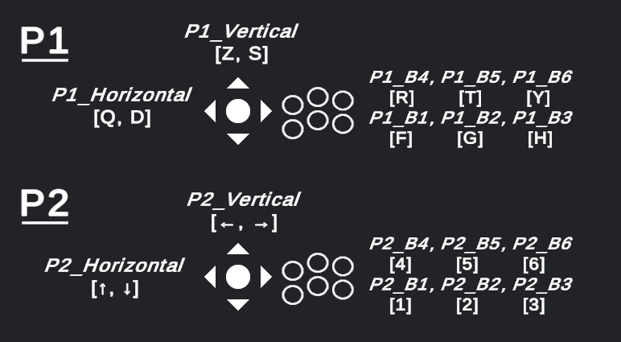

# Momentum — Jeu Unity

Projet Unity 2022.3 de **Momentum**, un jeu de parkour en duo (web multijoueur + borne arcade Anatidae). Build cible : WebGL pour le mode multi, Standalone Windows pour la borne.

## Démo

[](https://youtu.be/bgXhLfmgvyg)

## Architecture

Momentum est composé de trois dépôts :

| Composant | Rôle | Repo |
|---|---|---|
| **Jeu Unity** (ce repo) | Unity 2022.3 · gameplay, WebGL pour multi web, Standalone pour arcade | — |
| **Site web** | Next.js · lobby, partage de code, classement, héberge le build WebGL | [Hokoala/site-momentum](https://github.com/Hokoala/site-momentum) |
| **Game Server** (ce repo) | Colyseus + Prisma · matchmaking, état partagé, scores | [AloneDay-91/momentum-server](https://github.com/AloneDay-91/momentum-server) |

## Build modes

Le projet compile en deux configurations selon le define symbol :

| Mode | Define | Cible | Particularités |
|---|---|---|---|
| **Arcade** | (aucun) | Standalone Windows | 2 joueurs split-screen sur la même machine, Anatidae arcade client pour les scores |
| **Web** | `WEB_BUILD` | WebGL | 2 joueurs distants via Colyseus, NetworkPlayer pour le clone distant, WebMatchClock pour la synchro |

Le define `WEB_BUILD` est posé automatiquement sur les targets Standalone+WebGL via un Editor script (`Assets/Editor/BuildDefineSetup.cs`). Pour basculer manuellement : *File → Build Settings → Player Settings → Scripting Define Symbols*.

## Multijoueur — points clés

- **Tick rate 60 Hz** côté serveur, send rate 60 Hz côté client.
- **Interpolation snap-or-lerp** sur `NetworkPlayer` (snap si > 4 unités, sinon lerp à 45) pour éviter les téléportations visibles.
- **Plateformes mobiles déterministes** : `MovingPlatform` calcule sa position comme fonction pure de `WebMatchClock.MatchTime` (mirroir local de `GameState.elapsedTime` du serveur) → les deux clients restent en phase parfaite sans broadcast par plateforme.
- **Animations cross-client** : `actionSeq` + `actionId` dans `PlayerState` déclenchent jump/slide/vault sur le clone distant.
- **Bridge sortie** : `MomentumBridge.jslib` navigue directement `window.parent.location.href` vers `/classement/[code]` (pas de `postMessage` fragile).

## Démarrage local

1. **Unity Hub** : ouvrir le projet, Unity 2022.3.62f1 ou compatible.
2. **Serveur Colyseus** doit tourner en local pour tester le multi web (`ws://localhost:2567`).
3. **Site Next.js** sert le build WebGL et fournit le matchmaking.
4. *File → Build Settings* → choisir la target (Standalone pour arcade, WebGL pour web).
5. Vérifier que `apiBaseUrl` sur `GameSessionManager` pointe vers le bon serveur :
   - Dev local : `http://localhost:3000`
   - Prod : `https://momentum.mmi23f03.fr`
6. Build → glisser le contenu dans `public/webgl/` du site Next.js.

## Structure des scripts

```
Assets/Scripts/
├── GameManager.cs                 # state machine, ShowFinalGameOver, QuitToMenu
├── GameSessionManager.cs          # REST API client, multiplayer setup en WEB_BUILD
├── ScoreManager.cs                # agrégation des scores par joueur
├── PlayerScripts/                 # input, mouvement, animation
├── Parkour/                       # slide, vault, wall-run
├── Traps/                         # LaserWall, MovingPlatform (sync déterministe)
└── Multiplayer/                   # WEB_BUILD only
    ├── NetworkManager.cs          # Colyseus client
    ├── NetworkPlayer.cs           # clone distant + interpolation
    ├── LocalPlayerSync.cs         # envoi de l'état local au serveur
    ├── WebMatchClock.cs           # horloge serveur partagée
    ├── WebBootstrap.cs            # lit sessionId+token depuis l'URL iframe
    └── Schema/                    # types générés par @colyseus/schema
```

---

# Anatidae Toolkit (base du projet)

Ce projet a été démarré à partir du toolkit Anatidae pour la compatibilité arcade. La documentation complète du toolkit suit ci-dessous.

## 0. Contenu du toolkit

Ce repo contient les éléments pour démarrer un projet compatible Anatidae ou pour ajouter les fonctionnalités Anatidae à un jeu existant :

- **Un projet Unity** configuré pour créer un jeu compatible avec Anatidae
- **Anatidae_toolkit.unitypackage** (onglet Releases) : Pour rendre un jeu Unity existant compatible avec la borne (de la configuration supplémentaire sera nécessaire, c.f [**3. Anatidae Toolkit pour Unity**](#3-anatidae-toolkit-pour-unity)).

## 1. Fonctionnement de Anatidae

Anatidae est une interface qui permet de sélectionner des jeux WebGL stockés dans un dossier, ainsi que de stocker des informations supplémentaires au jeu à l'aide de l'[API](#4-anatidae-api). Son code source est disponible ici : [**anatidae-arcade**](https://github.com/XariusExcl/anatidae-arcade)

## 2. Anatidae Toolkit pour Unity

### Input

Le toolkit actuel utilise l'ancien Input Manager. Des axes et des boutons sont créés pour correspondre aux contrôleurs de la borne.

Si vous utilisez le .unitypackage pour rendre compatible un jeu existant, remplacez le fichier `InputManager.asset` du dossier `ProjectSettings/` de votre projet existant par celui téléchargé.

Dans le projet exemple, les boutons et axes sont attribués aux touches du clavier suivantes :



| Type | Nom |
|:---:|-----|
| Axes | P1_Vertical, P1_Horizontal, P2_Vertical, P2_Horizontal |
| Boutons | P1_Start, P1_B1, P1_B2, P1_B3, P1_B4, P1_B5, P1_B6, P2_Start, P2_B1, P2_B2, P2_B3, P2_B4, P2_B5, P2_B6, Coin|

Pour les utiliser dans vos scripts, vous pouvez écrire `Input.GetAxis("P1_Horizontal")` ou `Input.GetButtonDown("P2_B4")` par exemple.

### Prefab AnatidaeInterface

Le prefab AnatidaeInterface doit se trouver dans chaque scène de votre jeu. Il contient différents GameObjects :

- `HighscoreNameInput` Est le menu de saisie d'un highscore par le joueur.
- `HighscoreUI` Est l'écran d'affichage des highscores existants. Les highscores affichés utilisent le prefab `HighscoreEntry`.
